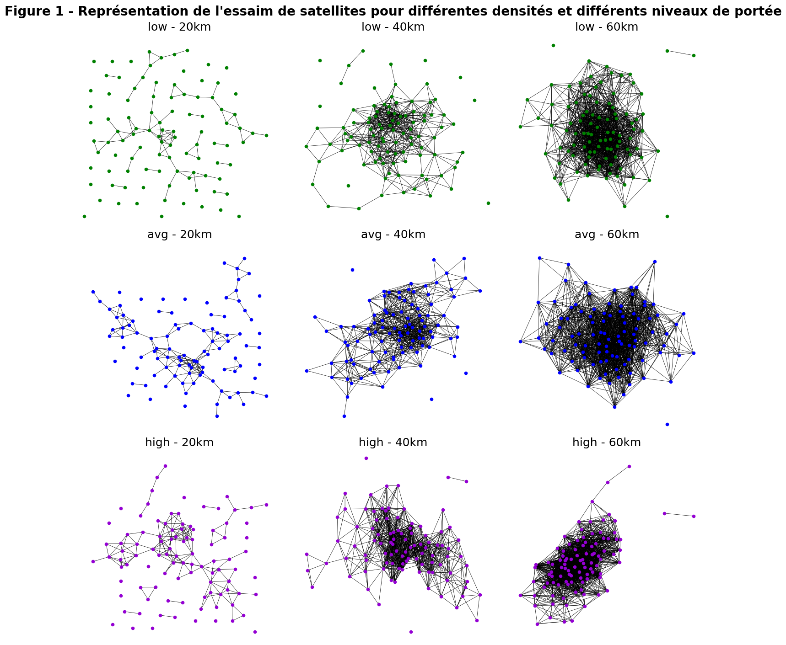

# projet-graphe

This small project was developed as part of a university course on graph theory. It focuses on the modeling and analysis of a swarm of nanosatellites. The goal is to analyze the communication graph of the swarm at three different density levels (low, medium, high), based on satellite positions provided in CSV files. The specification of this project is given in french in [Projet_Graphes_2023-2024.pdf](Projet_Graphes_2023-2024.pdf).

The jupyter notebook [code.ipynb](code.ipynb) contains all the project, many figures and some analysis of the results.

